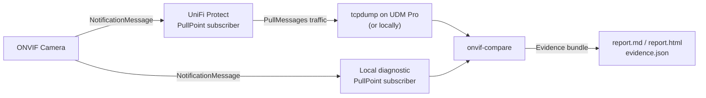
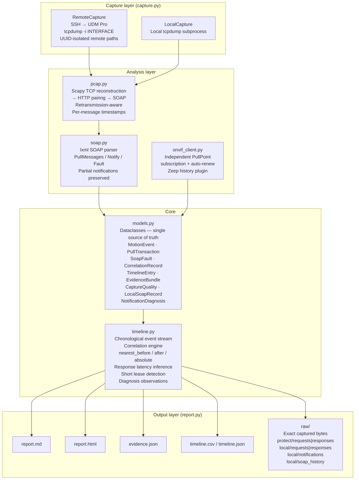
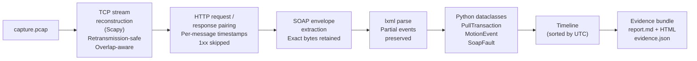
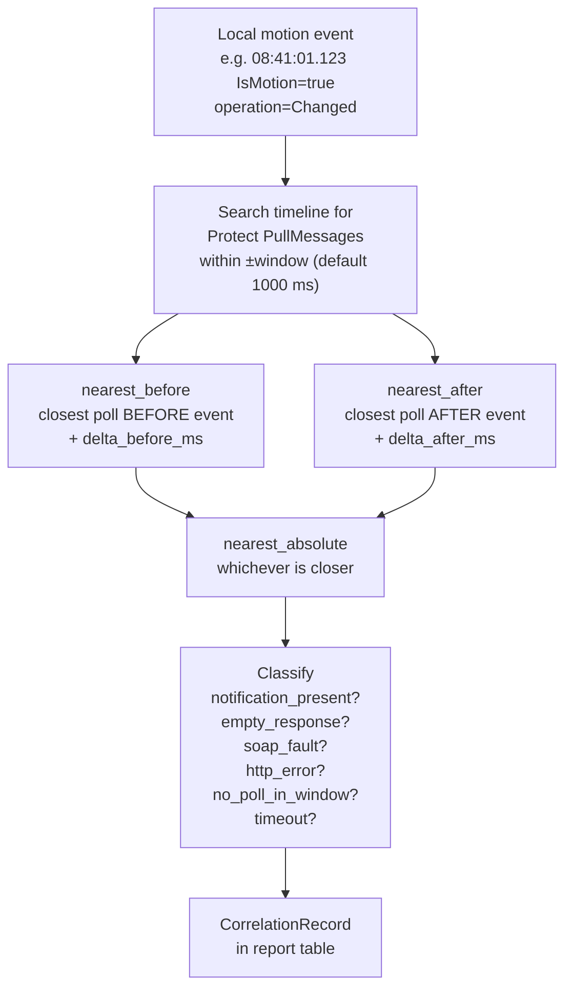
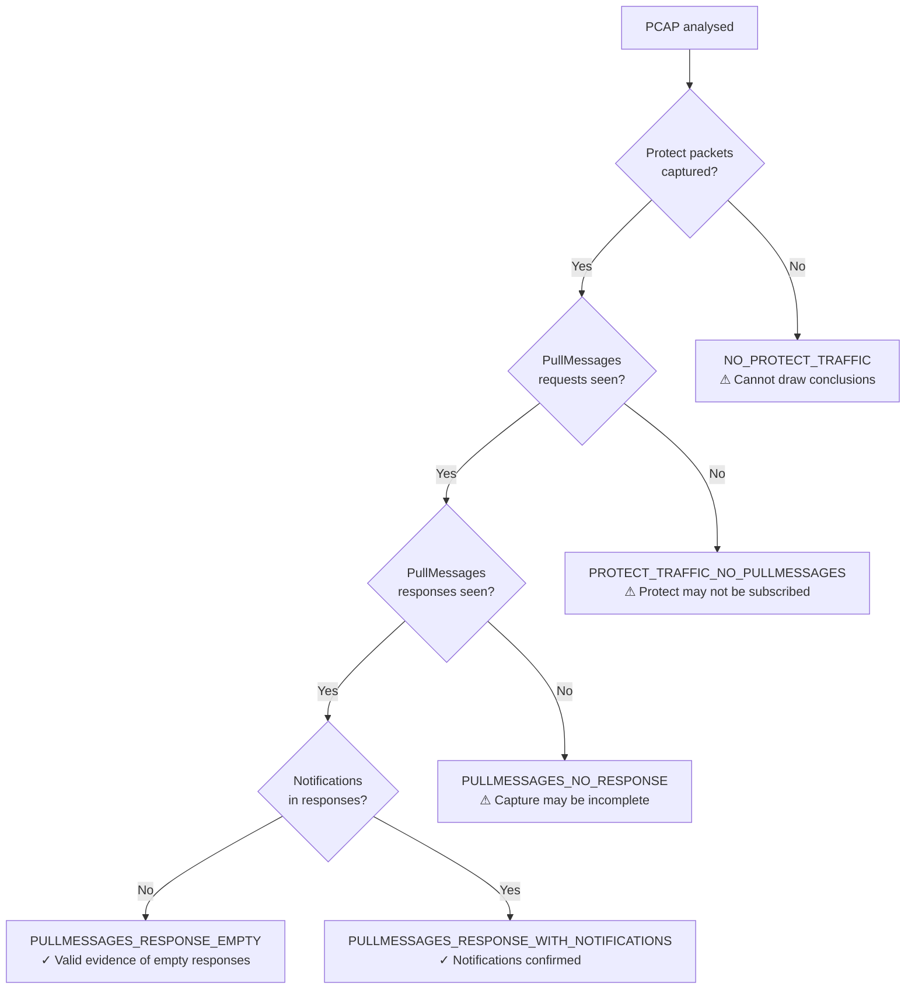

# ONVIF PullPoint Forensic Comparator

Determines conclusively whether an ONVIF camera delivers motion notifications
to UniFi Protect's PullPoint subscription.

Produces an evidence bundle suitable for submission to Ubiquiti or the camera
vendor.

---

## How it works

The tool runs two independent PullPoint subscribers simultaneously:

1. **UniFi Protect** — already subscribed to the camera. The tool captures
   its traffic passively via `tcpdump` on the UDM Pro's bridge interface.
2. **Local diagnostic subscriber** — a second, independent subscription
   created by this tool directly on the camera.

If the local subscriber receives motion events but Protect's PullMessages
responses are empty, that is strong evidence of a camera interoperability
problem rather than a motion detection failure.



---

## Architecture



### Data flow



### Correlation engine



### Capture quality gate



---

## Modules

| Module | Responsibility |
|---|---|
| `models.py` | All dataclasses. No logic. Single source of truth for every data structure. |
| `capture.py` | `RemoteCapture` (SSH + tcpdump, UUID-isolated paths) and `LocalCapture` (subprocess). Interface auto-discovery. SFTP download. |
| `onvif_client.py` | Independent PullPoint subscription. Auto-renews on expiry. Thread-safe event collection. Zeep history plugin captures complete SOAP envelopes. |
| `pcap.py` | Scapy TCP stream reconstruction (retransmission-aware, overlap-safe) → HTTP pairing (per-message timestamps) → SOAP extraction. No tshark. |
| `soap.py` | lxml SOAP parser. Handles PullMessagesResponse, CreatePullPointSubscription, Renew, Unsubscribe, Notify, Fault. Preserves malformed notifications as partial evidence. |
| `timeline.py` | Chronological event stream. Correlation engine (nearest_before / nearest_after / nearest_absolute). Capture quality observations. |
| `report.py` | Markdown + HTML from the same `EvidenceBundle`. Saves exact captured bytes to disk. JSON / CSV timeline export. |
| `util.py` | SHA-256 hashing (file and in-memory), UTC timestamps, local IP discovery, stream label formatting. |
| `main.py` | Argument parsing. Subcommands: `capture`, `analyse`, `report`. |

---

## Installation

```bash
git clone https://github.com/disappointingsupernova/UDM-Pro-ONVIF-Diagnostics
cd UDM-Pro-ONVIF-Diagnostics
pip install -r requirements.txt
```

**Runtime requirements**

| Package | Purpose |
|---|---|
| `scapy>=2.5` | TCP stream reconstruction from PCAP |
| `lxml>=4.9` | SOAP XML parsing |
| `onvif-zeep>=0.2.12` | ONVIF camera client (live capture mode) |
| `paramiko>=3.0` | SSH / SFTP to UDM Pro (remote capture mode) |
| `zeep>=4.2` | WSDL transport layer for onvif-zeep |
| `tcpdump` | Must be present on the UDM Pro (remote) or locally (local mode) |

Python 3.8+ required.

---

## Running the tool

There are three ways to invoke it depending on whether you have installed the
package or are running directly from the cloned repository.

**Option 1 — `python3 -m onvif_compare` (no install required)**

From the project root directory:

```bash
cd /path/to/UDM-Pro-ONVIF-Diagnostics

python3 -m onvif_compare capture \
  --camera-ip 10.54.4.13 \
  --ssh-host  10.54.4.1 \
  --protect-ip 10.54.4.1 \
  --duration 60

python3 -m onvif_compare analyse \
  --pcap capture.pcap \
  --camera-ip 10.54.4.13 \
  --protect-ip 10.54.4.1

python3 -m onvif_compare --help
```

You must run from the **project root** (the directory that contains the
`onvif_compare/` folder), not from inside `onvif_compare/` itself.

**Option 2 — install in editable mode (makes `onvif-compare` available system-wide)**

```bash
cd /path/to/UDM-Pro-ONVIF-Diagnostics
pip install -e .
```

After this the `onvif-compare` command works from any directory:

```bash
onvif-compare capture \
  --camera-ip 10.54.4.13 \
  --ssh-host  10.54.4.1 \
  --protect-ip 10.54.4.1 \
  --duration 60
```

**Option 3 — install normally**

```bash
pip install .
```

Same as option 2 but not editable.

> **Common mistake:** running `python3 main.py` from inside the
> `onvif_compare/` directory fails with
> `ImportError: attempted relative import with no known parent package`.
> The modules use relative imports and must be run as a package.
> Always use `python3 -m onvif_compare` from the project root, or install
> first.

---

## Subcommands

### `capture` — live capture and analysis

Connects to the camera, starts an independent PullPoint subscription, SSHes
to the UDM Pro to run `tcpdump`, waits for the requested duration, downloads
the PCAP, analyses it, and writes the evidence bundle — all in one step.

```bash
# If installed
onvif-compare capture \
  --camera-ip  192.168.1.100 \
  --protect-ip 10.54.4.1 \
  --ssh-host   10.54.4.1 \
  --duration   60

# Without installing
python3 -m onvif_compare capture \
  --camera-ip  192.168.1.100 \
  --protect-ip 10.54.4.1 \
  --ssh-host   10.54.4.1 \
  --duration   60
```

**All `capture` flags**

| Flag | Default | Description |
|---|---|---|
| `--camera-ip` | required | ONVIF camera IP address |
| `--camera-port` | `8000` | ONVIF service port |
| `--camera-user` | `admin` | ONVIF username |
| `--camera-password` | prompted | ONVIF password |
| `--protect-ip` | `10.54.4.1` | UniFi Protect IP address |
| `--capture` | `remote` | `remote` (SSH to UDM Pro) or `local` |
| `--ssh-host` | required for remote | SSH hostname / IP |
| `--ssh-port` | `22` | SSH port |
| `--ssh-user` | `root` | SSH username |
| `--ssh-key` | — | Path to SSH private key file |
| `--ssh-password` | — | Flag: prompt for SSH password |
| `--keep-remote` | — | Flag: do not delete PCAP from UDM Pro after download |
| `--interface` | auto-detected | `tcpdump` interface (e.g. `br554`). See note below. |
| `--duration` | `60` | Capture duration in seconds |
| `--correlation-window` | `1000` | Correlation search window in milliseconds |
| `--output-dir` | `evidence_YYYYMMDD_HHMMSS` | Where to write the evidence bundle |
| `--log-level` | `WARNING` | `DEBUG` / `INFO` / `WARNING` / `ERROR` |

**Interface selection**

The `--interface` flag specifies which network interface `tcpdump` listens on.
On a UDM Pro, camera traffic typically flows through a VLAN bridge interface
such as `br554` (VLAN 554). The correct interface depends entirely on your
network configuration.

- If you know the interface, pass it explicitly: `--interface br554`
- If you omit it, the tool SSHes in, runs `ip -brief link`, and:
  - Auto-selects if exactly one `br*` interface is found
  - Lists all candidates and exits with an error if multiple bridges exist

```bash
# Explicit interface (recommended)
python3 -m onvif_compare capture --camera-ip 192.168.1.100 --ssh-host 10.54.4.1 \
  --protect-ip 10.54.4.1 --interface br554 --duration 60

# Auto-detect (single bridge only)
python3 -m onvif_compare capture --camera-ip 192.168.1.100 --ssh-host 10.54.4.1 \
  --protect-ip 10.54.4.1 --duration 60
```

**SSH authentication**

```bash
# Key-based (recommended — no password prompt)
python3 -m onvif_compare capture --camera-ip 192.168.1.100 --ssh-host 10.54.4.1 \
  --protect-ip 10.54.4.1 --ssh-key ~/.ssh/udm_rsa --duration 60

# Password-based
python3 -m onvif_compare capture --camera-ip 192.168.1.100 --ssh-host 10.54.4.1 \
  --protect-ip 10.54.4.1 --ssh-password --duration 60

# SSH agent (default if no key or password flag given)
python3 -m onvif_compare capture --camera-ip 192.168.1.100 --ssh-host 10.54.4.1 \
  --protect-ip 10.54.4.1 --duration 60
```

**Local capture mode** (lab / same-segment setups)

```bash
python3 -m onvif_compare capture --camera-ip 192.168.1.100 --protect-ip 10.54.4.1 \
  --capture local --interface eth0 --duration 60
```

---

### `analyse` — offline PCAP analysis

Analyses an existing PCAP file. No camera connection required. Useful for
re-analysing a capture with a different correlation window, or for analysing
a PCAP captured by other means (e.g. a port mirror or Wireshark).

```bash
# If installed
onvif-compare analyse \
  --pcap       capture.pcap \
  --camera-ip  192.168.1.100 \
  --protect-ip 10.54.4.1

# Without installing
python3 -m onvif_compare analyse \
  --pcap       capture.pcap \
  --camera-ip  192.168.1.100 \
  --protect-ip 10.54.4.1
```

**All `analyse` flags**

| Flag | Default | Description |
|---|---|---|
| `--pcap` | required | Path to PCAP file |
| `--camera-ip` | required | ONVIF camera IP address |
| `--protect-ip` | required | UniFi Protect IP address |
| `--local-ip` | — | Local subscriber IP, if known (improves classification) |
| `--correlation-window` | `1000` | Correlation search window in milliseconds |
| `--output-dir` | next to PCAP | Where to write the evidence bundle |
| `--log-level` | `WARNING` | `DEBUG` / `INFO` / `WARNING` / `ERROR` |

```bash
# Re-analyse with a wider correlation window
python3 -m onvif_compare analyse --pcap capture.pcap \
  --camera-ip 192.168.1.100 --protect-ip 10.54.4.1 \
  --correlation-window 2000

# Specify local subscriber IP for better source classification
python3 -m onvif_compare analyse --pcap capture.pcap \
  --camera-ip 192.168.1.100 --protect-ip 10.54.4.1 \
  --local-ip 192.168.1.50

# Write output to a specific directory
python3 -m onvif_compare analyse --pcap capture.pcap \
  --camera-ip 192.168.1.100 --protect-ip 10.54.4.1 \
  --output-dir /tmp/evidence_reolink_2024
```

---

### `report` — regenerate report from evidence.json

Re-renders `report.md` and `report.html` from an existing `evidence.json`.

```bash
onvif-compare report --evidence evidence_20240315_084100/evidence.json
# or
python3 -m onvif_compare report --evidence evidence_20240315_084100/evidence.json
```

> **Note:** Full JSON deserialisation is not yet implemented. The command
> returns exit code 2 and prints the exact `analyse` command to run instead.
> Use `analyse` with the original PCAP to regenerate the report.

---

## Evidence bundle

Every run produces a self-contained directory:

```
evidence_YYYYMMDD_HHMMSS/
├── capture.pcap          # Raw packet capture
├── capture.sha256        # SHA-256 digest for chain of custody
├── evidence.json         # Machine-readable full evidence bundle
├── report.md             # Human-readable Markdown report
├── report.html           # Self-contained HTML report
├── timeline.csv          # Chronological event stream (spreadsheet-friendly)
├── timeline.json         # Chronological event stream (machine-readable)
└── raw/
    ├── protect/
    │   ├── requests/
    │   │   └── stream_012_req.xml    # Exact captured bytes of Protect’s SOAP request
    │   └── responses/
    │       └── stream_012_resp.xml   # Exact captured bytes of camera’s SOAP response
    └── local/
        ├── notifications/
        │   └── notif_001.xml         # Raw NotificationMessage XML from live subscriber
        ├── requests/             # Local subscriber SOAP requests (from PCAP)
        ├── responses/            # Local subscriber SOAP responses (from PCAP)
        └── soap_history/
            ├── 0001_CreatePullPointSubscription_req.xml
            ├── 0001_CreatePullPointSubscription_resp.xml
            ├── 0002_PullMessages_req.xml
            └── 0002_PullMessages_resp.xml
```

The `raw/protect/` files contain every SOAP envelope **exactly as it appeared
on the wire** — written directly from the PCAP without re-serialisation.
The `raw/local/soap_history/` files contain complete SOAP envelopes captured
by the Zeep transport plugin, covering every operation the local subscriber
performed (CreatePullPointSubscription, PullMessages, Renew, Unsubscribe).
You can load `capture.pcap` directly into Wireshark and navigate to the frame
numbers recorded in `evidence.json`.

---

## Terminal output

At the end of every run the tool prints a summary:

```
======================================================
SUMMARY
======================================================
Camera:                    192.168.1.100:8000
Protect IP:                10.54.4.1
Capture duration:          60 s
Capture quality:           pullmessages_response_empty

Local IsMotion=true:       2
Local IsMotion=false:      2
Protect PullMessages:      12
Protect notifications:     0
Protect IsMotion=true:     0
Empty PullMessages:        12
SOAP faults:               0

OBSERVATIONS
------------------------------------------------------
  • The independent local subscriber received 2 IsMotion=true and
    2 IsMotion=false Changed events.
  • Protect issued 12 PullMessages request(s) during the capture period.
  • Of those, 12 returned HTTP 200 with zero NotificationMessage elements.
  • No SOAP faults were observed in the capture.
  • Protect received zero IsMotion=true notifications during the capture period.
  • Protect PullMessages average response latency: 48 ms (min 31 ms).
    Responses under 100 ms suggest the camera is not holding the connection
    open (long-polling not implemented).

Report:  /home/user/evidence_20240315_084100/report.md
HTML:    /home/user/evidence_20240315_084100/report.html
JSON:    /home/user/evidence_20240315_084100/evidence.json
======================================================
```

During capture, motion events are printed in real time as they arrive:

```
[LOCAL 08:41:01.123] Changed IsMotion=true
[LOCAL 08:41:05.456] Changed IsMotion=false State=false
```

The tool records observations. It does not assign blame.

---

## Report sections

Both `report.md` and `report.html` contain:

| Section | Contents |
|---|---|
| Environment | Camera IP/port/user, Protect IP, interface, capture host/mode, start/end UTC, requested duration, first/last packet UTC, observed duration, PCAP path, SHA-256 |
| Capture Quality | Traffic classification, Protect/local packet counts, PullMessages request/response counts, quality warnings |
| Summary | Counts of local events, Protect polls, notifications (fully parsed and partial), empty responses, faults |
| Timeline | Every event in UTC order — polls, motion events, faults, subscriptions |
| Protect PullMessages Transactions | Per-transaction table with HTTP status, notification count, fault code, stream index, frame numbers, links to raw XML |
| SOAP Faults | Fault code, subcode, reason, HTTP status, stream, frame (only if faults present) |
| Protect Notifications | Topic, UTC, IsMotion, State for fully-parsed notifications (only if present) |
| Protect Notifications (Partial) | UTC, topic, parse warnings, raw XML path for partially-parsed notifications (only if present) |
| Correlation | Local motion event → nearest Protect poll before/after (ms) → result |
| Observations | Ordered factual statements including response latency, short lease detection, diagnosis summaries, capture quality warnings |
| Diagnostic Analysis | Per-notification structural breakdown: diagnosis, namespaces used by camera, data items received, parse warnings (only if partial notifications present) |

---

## Correlation results

Each local `Changed` motion event is correlated against the nearest Protect
PullMessages poll within the configured window:

| Result | Meaning |
|---|---|
| `notification_present` | The nearest poll's response contained at least one `NotificationMessage` |
| `empty_response` | HTTP 200 but zero `NotificationMessage` elements |
| `soap_fault` | The nearest poll returned a SOAP fault |
| `http_error` | Non-200, non-fault HTTP status |
| `no_poll_in_window` | No Protect poll found within the correlation window |
| `timeout` | The nearest poll had no response recorded |

---

## Capture quality classification

Before drawing any conclusions the tool classifies what traffic was actually
observed in the PCAP:

| Classification | Meaning |
|---|---|
| `no_protect_traffic_captured` | No packets between Protect and the camera were seen. Zero notifications **cannot** be used as evidence. |
| `protect_traffic_captured_no_pullmessages` | Protect traffic was seen but no PullMessages requests. Protect may not have been subscribed. |
| `pullmessages_captured_no_response` | PullMessages requests were seen but no responses. Capture may be incomplete. |
| `pullmessages_response_empty` | Responses were captured and contained zero notifications. Valid evidence. |
| `pullmessages_response_with_notifications` | Responses contained notifications. |

Quality warnings appear in the Observations section of the report.

---

## Provenance

Every object in the evidence bundle records where it came from:

| Field | Description |
|---|---|
| `source` | `"protect"` / `"local"` / `"camera"` / `"unknown"` |
| `tcp_stream` | Scapy TCP stream index — paste into Wireshark's stream filter |
| `request_frame` / `response_frame` | Per-message PCAP frame numbers for direct Wireshark lookup |
| `raw_xml` | Re-serialised XML (pretty-printed by lxml) |
| `raw_body_bytes` | Exact captured bytes — never modified |
| `body_sha256` / `request_body_sha256` / `response_body_sha256` | SHA-256 of exact bytes for chain of custody |
| `request_xml_path` / `response_xml_path` | Relative path to the saved file in `raw/` |
| `parse_status` | `"ok"` or `"partial"` — partial notifications are preserved, not discarded |
| `parse_warnings` | List of human-readable issues found during parsing |
| `timestamp_valid` | `False` when the camera's `UtcTime` was absent or unparseable |
| `diagnosis` | `NotificationDiagnosis` enum value classifying the specific structural failure (e.g. `utctime_absent`, `ismotion_item_wrong_name`) |
| `actual_namespaces` | Dict of XML namespace prefix → URI as used by the camera in that notification |

`CaptureMetadata` additionally records:

| Field | Description |
|---|---|
| `observed_start_utc` | Timestamp of the first packet in the PCAP |
| `observed_end_utc` | Timestamp of the last packet in the PCAP |
| `observed_duration_seconds` | Actual evidence interval from packet timestamps (may differ from `--duration` if capture started late or was interrupted) |

Live subscriber events (from `onvif_client.py`) set `tcp_stream = -1` and
`frame_number = -1` because they are not captured from the PCAP.

---

## Design constraints

- **No tshark.** The parser never invokes tshark or parses its text output.
- **No regex XML.** XML is always parsed with lxml. Never located by regex.
- **No data loss.** Every parsed object retains its original raw bytes and re-serialised XML.
- **No invented timestamps.** Missing or unparseable `UtcTime` uses an epoch sentinel (`1970-01-01`), never `datetime.now()`.
- **Full provenance.** Every event records its source, TCP stream, and per-message frame numbers.
- **Evidence-based conclusions.** The tool classifies observations; it does not assign blame.
- **Capture quality gates.** Zero notifications is only reported as evidence when the capture affirmatively shows Protect polling.
- **Partial notifications preserved.** Malformed or vendor-specific notifications are returned as `parse_status="partial"` rather than discarded.
- **Scapy only.** If Scapy is unavailable the tool fails with a clear error rather than falling back silently.
- **Retransmission-safe TCP reconstruction.** Duplicate segments are deduplicated; overlapping bytes are counted.
- **Capture abstraction.** `RemoteCapture` and `LocalCapture` both implement `CaptureBackend`. Adding a new capture backend requires no changes to the analysis engine.
- **UUID-isolated remote captures.** Each run uses `/tmp/onvif-compare-<uuid>/` so concurrent runs never collide.

---

## Tests

```bash
pip install pytest pytest-cov
pytest
```

```
186 tests · 0 failures
```

| Test file | Module under test | Tests |
|---|---|---|
| `test_soap.py` | `soap.py` | 49 |
| `test_pcap.py` | `pcap.py` | 40 |
| `test_capture.py` | `capture.py` | 10 |
| `test_onvif_client.py` | `onvif_client.py` | 36 |
| `test_timeline.py` | `timeline.py` | 21 |
| `test_report.py` | `report.py` | 30 |

Synthetic XML fixtures live in `tests/fixtures/`. Synthetic PCAP fixtures
are generated by `tests/fixtures/make_pcaps.py` and committed to
`tests/fixtures/pcap/`. Drop real captures into that directory and add
regression tests referencing them.

---

## Known limitations

- The `report` subcommand re-render path is a stub. Full JSON deserialisation
  back to `EvidenceBundle` is not yet implemented. The command returns exit
  code 2 and prints the exact `analyse` command to run instead.
- `LocalCapture` interface auto-discovery uses `ip -brief link`, which is
  Linux-only. On Windows, pass `--interface` explicitly.
- The ONVIF subscriber does not yet proactively renew the lease before
  expiry. It recreates the subscription on any exception, which is
  functionally equivalent but produces a log warning on cameras (such as
  Reolink) that terminate subscriptions after ~60 s.
- The Zeep history plugin (`_SoapHistoryPlugin`) captures SOAP envelopes
  from the local subscriber but these are not yet written to the `raw/local/`
  directory in the evidence bundle. They are available in `subscriber.soap_history`
  for programmatic access.
