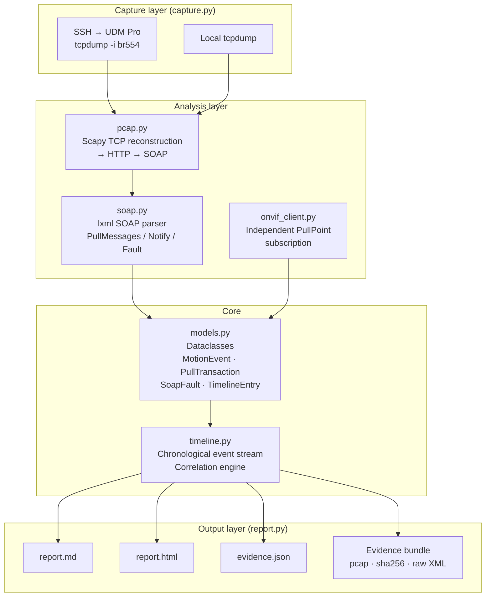
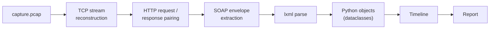
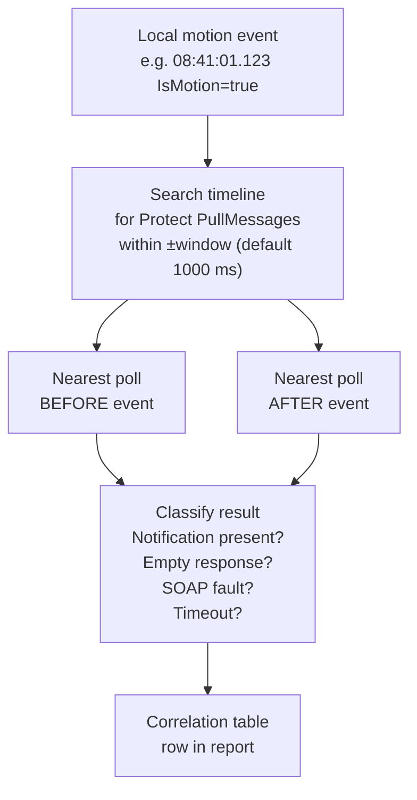

# ONVIF PullPoint Forensic Comparator

Determines conclusively whether an ONVIF camera delivers motion notifications
to UniFi Protect's PullPoint subscription.

Produces an evidence bundle suitable for submission to Ubiquiti or the camera
vendor.

---

## Architecture



### Data flow



### Correlation engine



---

## Modules

| Module | Responsibility |
|---|---|
| `models.py` | All dataclasses. No logic. |
| `capture.py` | SSH or local `tcpdump`. Interface discovery. SFTP download. |
| `onvif_client.py` | Independent PullPoint subscription. Auto-renew. |
| `pcap.py` | Scapy TCP reconstruction → HTTP → SOAP. No tshark. |
| `soap.py` | lxml SOAP parser. PullMessages, Notify, Fault, SimpleItem. |
| `timeline.py` | Chronological event stream. Correlation engine. |
| `report.py` | Markdown + HTML from the same internal model. Evidence bundle. |
| `util.py` | Shared helpers (hashing, timestamps, IP utilities). |
| `main.py` | Argument parsing. Subcommands: `capture`, `analyse`, `report`. |

---

## Subcommands

```
onvif-compare capture   --camera-ip 192.168.1.100 \
                        --ssh-host  10.54.4.1 \
                        --protect-ip 10.54.4.1 \
                        --duration 60

onvif-compare analyse   --pcap capture.pcap \
                        --camera-ip 192.168.1.100 \
                        --protect-ip 10.54.4.1

onvif-compare report    --evidence evidence.json
```

---

## Evidence bundle

```
evidence_YYYYMMDD_HHMMSS/
├── capture.pcap
├── capture.sha256
├── evidence.json
├── report.md
├── report.html
├── timeline.csv
├── timeline.json
└── raw/
    ├── protect/
    │   ├── requests/
    │   │   └── stream_012_req.xml
    │   └── responses/
    │       └── stream_012_resp.xml
    └── local/
        ├── notifications/
        │   └── notif_001.xml
        ├── requests/
        └── responses/
```

---

## Requirements

- Python 3.8+
- `scapy>=2.5` — TCP stream reconstruction
- `onvif-zeep>=0.2.12` — ONVIF camera client
- `lxml>=4.9` — SOAP XML parsing
- `paramiko>=3.0` — SSH / SFTP to UDM Pro
- `tcpdump` on the UDM Pro (remote mode) or locally (local mode)

Install:

```bash
pip install -r requirements.txt
```

---

## Design constraints

- **No tshark.** The parser never invokes tshark or parses its text output.
- **No regex XML.** XML is always parsed with lxml. Never located by regex.
- **No data loss.** Every parsed object retains its original raw XML.
- **Full provenance.** Every event records its source, TCP stream, and frame numbers.
- **Evidence-based conclusions.** The tool classifies observations; it does not assign blame.
